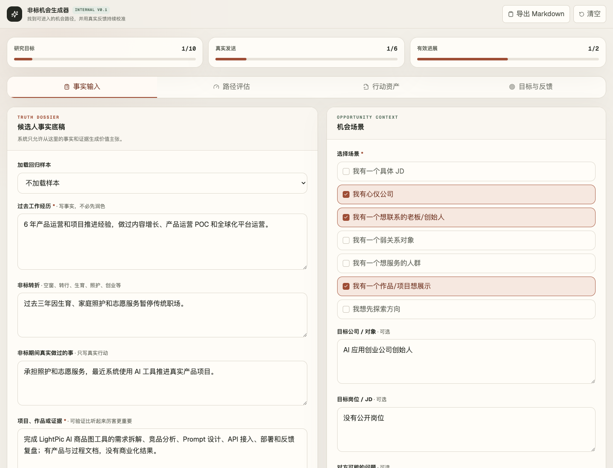
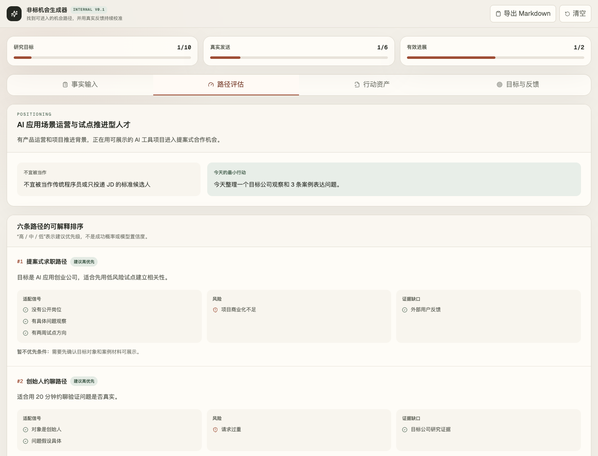
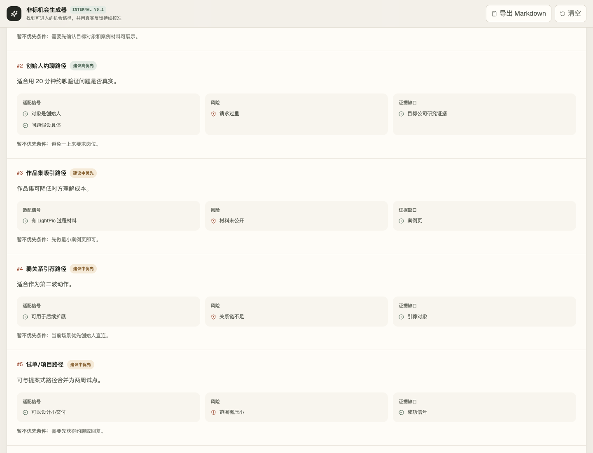
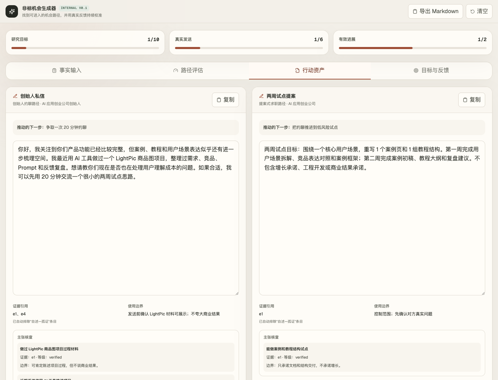
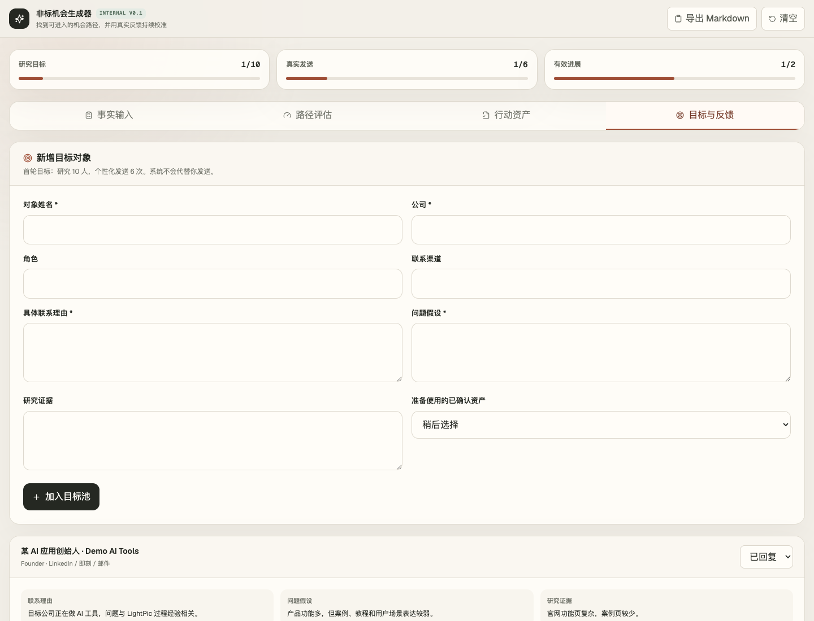

# 非标机会生成器（Internal V0.1）

面向测试者和 AI agent 的内部验证原型。它不是传统求职工具，也不是面试外挂；它帮助非标履历用户把事实、证据、机会路径和真实行动连成一个可校准的工作台。

- 在线试用：[nonstandard-opportunity-generator.vercel.app](https://nonstandard-opportunity-generator.vercel.app)
- Agent 测试说明：[AGENT_TESTING.md](./AGENT_TESTING.md)
- 当前形态：单用户、本地 `localStorage`、无登录、无数据库

## 1 分钟理解

这个工具服务的人群包括职业空窗、妈妈重返职场、转行者、自由职业者、创业失败者、长期照护者、普通人向 AI 相关工作转型等。

它的目标不是“帮用户写得更厉害”，而是：

```text
理解自己
→ 识别可证明价值与边界
→ 判断更适合哪条机会路径
→ 找到具体对象
→ 生成可编辑行动资产
→ 记录真实发送与反馈
→ 校准下一步
```

核心护栏：

- 不伪造经历、成果、客户、收入或技术能力
- 不把空窗、生育、照护、失败经历硬包装成商业成果
- 不默认传统 JD 投递是唯一机会入口
- 不自动发送任何消息
- 对外材料必须回溯到事实、证据和验证等级

## 15 分钟测试路径

1. 打开在线 demo 或本地运行项目。
2. 在“事实输入”里选择 `妈妈重返 · AI 产品运营` 样本。
3. 点击生成结构化机会评估。
4. 检查六条路径是否排序合理：提案式求职 / 创始人约聊 / 作品集吸引应优先于标准岗位投递。
5. 检查证据账本：是否区分 `verified`、`self_reported_consistent`、`self_reported_isolated`。
6. 生成行动资产。
7. 检查创始人私信、两周试点提案、约聊提纲是否能直接编辑使用。
8. 在“目标与反馈”里添加一个目标对象，记录一次模拟回复。
9. 运行反馈校准，检查系统是否只给一个具体下一步，而不是重新生成泛泛报告。

## 界面截图

### 事实输入



### 路径评估



### 证据账本



### 行动资产与主张核查



### 目标与反馈



## 测试者重点看什么

请优先审查这三件事：

1. 三个接口职责是否清楚
   - `assess`：只做路径判断、证据账本、风险边界
   - `action-package`：只根据已确认评估生成行动资产
   - `calibrate`：只根据真实行动反馈定位失败层级和下一步

2. 证据验证等级是否真的约束对外文案
   - 孤证是否被排除在行动包之外
   - 自述但内部一致的内容是否保持第一人称自陈
   - 每份行动资产是否包含 `claimChecks`
   - 是否出现“工程师”“商业成功”“增长专家”等身份或成果拔高

3. 用户是否能在 30 分钟内进入真实行动
   - 是否知道该找谁
   - 是否知道怎么开口
   - 是否知道最低风险合作方式
   - 是否能记录发送、回复和下一步

## 技术架构

- Next.js App Router
- TypeScript
- Tailwind CSS
- OpenAI Responses API
- Structured Outputs
- 版本化浏览器 `localStorage`

核心接口：

| 接口 | 作用 |
| --- | --- |
| `POST /api/assess` | 返回结构化 `OpportunityAssessment` |
| `POST /api/action-package` | 根据已确认评估返回 `ActionAsset[]` |
| `POST /api/calibrate` | 根据一次真实行动与反馈返回 `FeedbackDiagnosis` |
| `GET /api/regression-samples` | 返回六类固定回归样本 |

Markdown 只是导出格式，不是内部数据源。

## 本地运行

要求 Node.js 20.9 或更高版本。

```bash
npm install
cp .env.example .env.local
npm run dev
```

打开 [http://localhost:3000](http://localhost:3000)。

`.env.local`：

```dotenv
LLM_API_KEY=你的密钥
LLM_BASE_URL=https://api.openai.com/v1
LLM_MODEL=gpt-5.5
```

也兼容读取 `OPENAI_API_KEY`。未配置密钥时，页面会清楚提示；本地目标与行动记录仍可编辑。

## 回归测试

启动本地服务后运行：

```bash
# 终端 1
npm run dev

# 终端 2
REGRESSION_RUNS=1 npm run test:regression
```

完整回归：

```bash
REGRESSION_RUNS=3 npm run test:regression
```

通过标准：

- 6 个样本各 1 次：目标 100% 通过
- 完整 18 次：总通过率至少 90%
- 高风险正向身份声明失败数必须为 0
- 行动资产必须包含 `claimChecks`

注意：回归测试会调用模型 API，可能消耗额度，也可能受网络波动影响。

## 截图更新

本仓库提交了静态截图。若需要重新生成：

```bash
npm run build
npm start
PLAYWRIGHT_NODE_MODULES=/path/to/node_modules node scripts/capture-screenshots.mjs
```

如果本项目安装了 Playwright，可省略 `PLAYWRIGHT_NODE_MODULES`。

## 已知限制

- 当前是单用户本地工作台
- 数据只保存在浏览器 `localStorage`
- 没有登录、数据库、云同步、权限系统
- 没有岗位爬虫、自动投递、简历 PDF 解析、实时面试辅助
- 在线 demo 会消耗项目所有者的模型 API 额度，请避免批量生成
- `verified` 表示“用户提供了可检查材料”，不等于系统已经实际打开并核验该材料
- 当前主要验证职业岗位、项目试单、创始人合作、弱关系引荐四类机会

## 提交节奏

这个仓库不追求一次性大改。后续每周至少合并一个真实改善：

- 本周：真实性边界与测试入口
- 下周：根据 tester / agent 反馈修一个具体问题

每次 commit 必须对应真实产品或工程改善，不为了贡献图硬提交。
